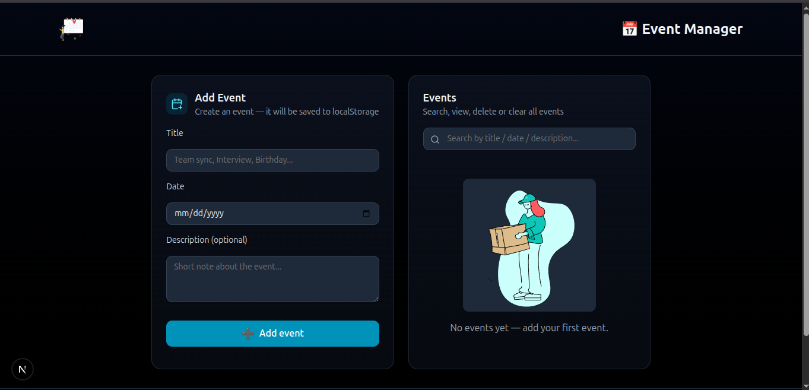
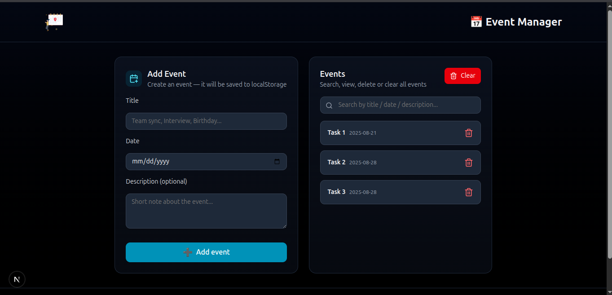

# Event Manager 

## Project summary
This app is a small **Event Manager page (/events)** built inside a **Next-Forge monorepo (`apps/web`)**.  
It keeps all data client-side using **Zustand with persist (localStorage)**.  

UI is a **dark theme**, with a **two-column layout**:
- Left column → Add Event form  
- Right column → Search + Event List  
- **Empty state**: shows a Lottie animation  
- Includes **Clear All (localStorage)** option  
- Footer with **name & links**

### File locations (modular components version)
- `apps/web/store/eventStore.ts`
- `apps/web/components/EventForm.tsx`
- `apps/web/components/EventList.tsx`
- `apps/web/app/events/page.tsx`

---

## What’s included / Features
- `/events` page (App Router)
- **Add event** (title, date, optional description)
- **Event list** with delete per item
- **Search/filter** (title/date/description)
- **Local persistence** (Zustand persist → localStorage)
- **Lottie animation** for empty state
- **Clear All** button
- **Dark theme styling** (Tailwind)
- **Lucide icons** on buttons/inputs
- **Footer** with info + links

---

## Tech stack
- Next.js (App Router, inside Next-Forge Turbo monorepo)
- TypeScript
- Tailwind CSS
- pnpm (package manager)
- Zustand + persist
- react-hook-form
- lottie-react
- lucide-react
- uuid (or `crypto.randomUUID()`)

---

## Structure
- App is inside: `apps/web/`
- Routes: `/app/events/page.tsx → http://localhost:3000/events`
- Public assets: `apps/web/public/`
  - Example animation: `apps/web/public/animations/empty.json`
- Custom typings go in: `apps/web/types/`

---

## Prerequisites
- Node.js (>= 18)
- pnpm (v7+ or v8+)
- Git (optional, for cloning)

---

## Project Structure

apps/web/ <br>
├── app/ <br>
│ └── events/ <br>
│ └── page.tsx # Main Events Page (2-column layout) <br>
├── components/ <br>
│ ├── EventForm.tsx # Form for adding events <br>
│ └── EventList.tsx # Event list, search, clear all, empty state <br>
├── store/ <br>
│ └── eventStore.ts # Zustand store (persist → localStorage) <br>
├── public/ <br>
│ └── animations/ <br>
│ └── empty.json # Lottie animation for empty state <br>

## Install & run (step-by-step)

1. **Clone repo**
```bash
git clone <repo-url>
cd <repo-root>
```


2. **Install dependencies (monorepo root)**
```bash
pnpm install
_If install fails at root:_
cd apps/web
pnpm install
```

3. **Install runtime dependencies**
```bash
pnpm add zustand react-hook-form lottie-react lucide-react
```

4. **Install dev types**
```bash
pnpm add -D @types/uuid
```

5. **Start dev server**

```bash
pnpm dev
```

Navigate to: `http://localhost:3000/events`

---

## Files & folders

### `store/eventStore.ts`
- Zustand + persist (localStorage) store.  
- Provides: `events`, `addEvent`, `removeEvent`, `clearEvents`.  

### `components/EventForm.tsx`
- Uses `react-hook-form`.  
- Adds new events `{ id, title, date, description }`.  

### `components/EventList.tsx`
- Renders events from store.  
- Includes **search/filter**, **delete per item**, **Clear All**, and **Lottie animation when empty**.  

### `app/events/page.tsx`
- Renders full two-column UI layout.  
- Includes header, form, list, footer.

---

## Lottie animation: where to put it and how to use it

### Recommended location
`apps/web/public/empty.json`

### Use in `EventList`:

## 📸 Screenshots





## 📜 License

MIT © 2025 Anjana Kumari <br>
Email: anjanasingh1257@gmail.com <br>
Portfolio : [Click to visit Portfolio](https://nextjs-portfolio-rosy-six.vercel.app/)